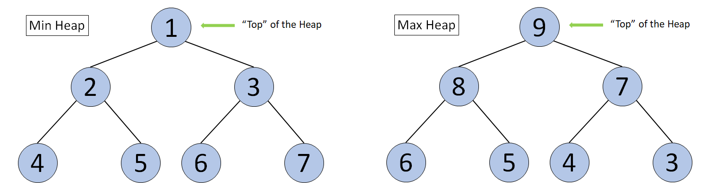

# Heap Data Structure
	Heap is a tree-bases data structure which satisfy the the below two conditions.
	1. It should be conmplete Binaty tree.
	2. The node value should either be equal or greater than/ equal or less than its children node value.
	
	Note: What is a complete binary tree
	A tree is said to be complete binary tree when a tree is filled from Top to Bottom and left to right manner, possibly the right or the lowest leaf can be empty.
	
# Types of Heap
	Heap can be of two types:
	1. # Max Heap:
		The value in the root Node or in the parent node of each sub tree should be equals or greater then its children value.
	2. # min Heap:
		The value in the root Node or in the parent node of each sub tree should be equals or lesser then its children value.
		
		
		
# Where to use
 Heap is useful where we need to find the maximum/minimum value as it givesa the O(1) time complexity to find it.
		
